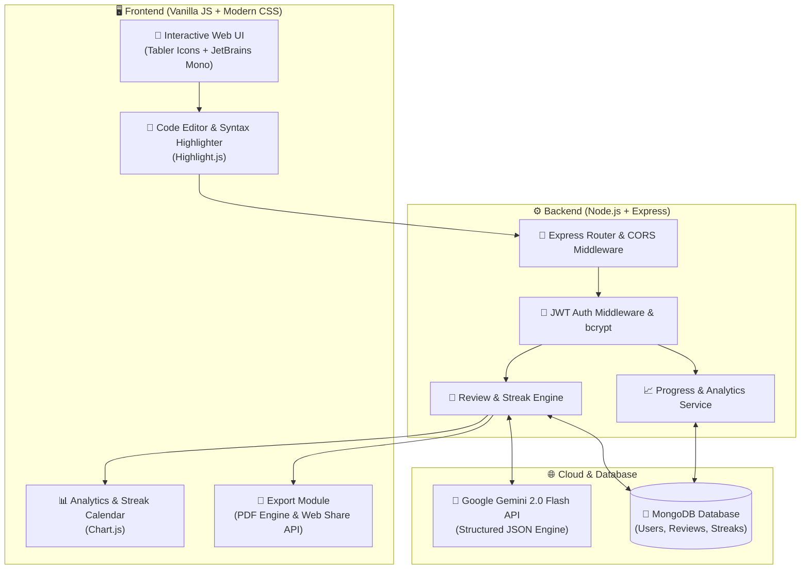

<div align="center">

# 🚀 Code Saathi (कोड साथी)
### *Your Intelligent AI-Powered Code Reviewer & Interactive Learning Mentor*

[](https://nodejs.org/)
[](https://expressjs.com/)
[](https://www.mongodb.com/)
[](https://ai.google.dev/)
[](https://developer.mozilla.org/)
[](LICENSE)

<br/>

<p align="center">
  <b>Code Saathi</b> is a full-stack developer mentorship platform engineered to transform how students and engineers learn to write clean, efficient, and interview-ready code. Powered by Google Gemini AI, it delivers instantaneous, contextual code reviews, complexity analysis, curated interview prep questions, and progressive skill roadmaps.
</p>

<p align="center">
  <a href="#-key-features">Key Features</a> •
  <a href="#-system-architecture">Architecture</a> •
  <a href="#-tech-stack">Tech Stack</a> •
  <a href="#-quick-start">Quick Start</a> •
  <a href="#-api-documentation">API Reference</a> •
  <a href="#-troubleshooting">Troubleshooting</a>
</p>

---

</div>

<br/>

## 🌟 Highlights at a Glance

<table>
  <tr>
    <td width="50%">
      <h3>🔍 Deep AI Code Analysis</h3>
      <ul>
        <li><b>Score & Quality Rating:</b> Instant 0–100 code health scoring.</li>
        <li><b>Mentor-Style Feedback:</b> Clear explanations without intimidating jargon.</li>
        <li><b>Time & Space Complexity:</b> Automatic Big-O ($O(N)$, $O(1)$) detection.</li>
        <li><b>Optimized Code:</b> Refactored, production-ready alternatives.</li>
      </ul>
    </td>
    <td width="50%">
      <h3>🎯 Career & Interview Readiness</h3>
      <ul>
        <li><b>Targeted Interview Questions:</b> 3 bespoke questions based on your code.</li>
        <li><b>Learning Roadmaps:</b> Step-by-step guidance on what to master next.</li>
        <li><b>PDF Export & Sharing:</b> Download formatted, printable review reports.</li>
        <li><b>Guest Mode + Auth:</b> Zero-friction trial or saved progress with JWT auth.</li>
      </ul>
    </td>
  </tr>
  <tr>
    <td width="50%">
      <h3>📈 Progress & Habit Tracking</h3>
      <ul>
        <li><b>28-Day Streak Calendar:</b> Visual activity tracking for consistency.</li>
        <li><b>Score Trends:</b> Real-time charts powered by Chart.js.</li>
        <li><b>Language Distribution:</b> Breakdown of all reviewed languages.</li>
      </ul>
    </td>
    <td width="50%">
      <h3>💻 Polished Developer Experience</h3>
      <ul>
        <li><b>Multi-Language Support:</b> Python, JS, TS, Java, C++, C, Go, Rust, Swift, Kotlin.</li>
        <li><b>Atom One Dark Syntax:</b> Clean syntax highlighting with line counters.</li>
        <li><b>One-Click Tools:</b> Format, copy, load templates, and clear workspace.</li>
      </ul>
    </td>
  </tr>
</table>

<br/>

---

## 🏗️ System Architecture



<br/>

---

## 📁 Project Structure

```text
code-saathi/
├── backend/
│   ├── middleware/
│   │   └── auth.js             # JWT verification middleware & session guard
│   ├── models/
│   │   ├── User.js             # User model with bcrypt password hashing
│   │   ├── Review.js           # Full AI review schema & metadata
│   │   └── Streak.js           # Daily streak & activity log schema
│   ├── routes/
│   │   ├── auth.js             # /api/auth (Register, Login, Me)
│   │   ├── review.js           # /api/review (Analyze, Guest, History, Delete)
│   │   └── progress.js         # /api/progress (Stats, Streak, Trends)
│   ├── .env.example            # Environment variables template
│   ├── package.json            # Backend dependencies & npm scripts
│   └── server.js               # Express entry point & static server
│
├── frontend/
│   ├── css/
│   │   └── main.css            # Dark glassmorphic design system
│   ├── js/
│   │   ├── api.js              # Centralized Fetch API client
│   │   ├── app.js              # App bootstrap & view routing
│   │   ├── auth.js             # Auth state, modal triggers & token storage
│   │   ├── editor.js           # Code textarea, syntax highlighter & line counter
│   │   ├── export.js           # PDF print generator, clipboard & share
│   │   ├── progress.js         # Chart.js analytics & 28-day calendar
│   │   └── results.js          # AI review renderer & breakdown cards
│   └── index.html              # Semantic, responsive single-page web app
│
└── README.md                   # Project documentation
```

<br/>

---

## 🛠️ Tech Stack & Libraries

| Domain | Technology / Library | Purpose |
| :--- | :--- | :--- |
| **Frontend UI** | HTML5, CSS3, ES6+ Vanilla JS | High-performance, zero-framework lightweight client |
| **Design & Icons** | Tabler Icons, Sora, JetBrains Mono | Modern typography and sleek developer aesthetic |
| **Syntax & Visuals** | Highlight.js (`atom-one-dark`), Chart.js | Real-time code syntax rendering & score analytics |
| **Backend Runtime** | Node.js & Express.js | RESTful API service & static frontend asset delivery |
| **Database & ODM** | MongoDB & Mongoose | Flexible NoSQL data layer for users, reviews, and streaks |
| **AI Review Engine** | Google Gemini API (`gemini-2.0-flash`) | Structured JSON generation for instant code diagnostics |
| **Security & Auth** | JSON Web Tokens (`jsonwebtoken`) & `bcryptjs` | Stateless session management & secure password hashing |

<br/>

---

## 🚀 Quick Start Guide

### 1. Prerequisites
Make sure you have the following installed on your machine:
* **Node.js** (v18.0.0 or later) — [Download Node.js](https://nodejs.org/)
* **MongoDB** (Local instance or free cloud cluster) — [MongoDB Atlas](https://www.mongodb.com/atlas)
* **Google Gemini API Key** (Free) — [Get Gemini API Key](https://aistudio.google.com/)

---

### 2. Installation & Setup

```bash
# 1. Clone the repository
git clone https://github.com/RishikantRathore/code-saathi.git

# 2. Navigate to backend directory
cd code-saathi/backend

# 3. Install dependencies
npm install
```

---

### 3. Configure Environment Variables

Create a `.env` file inside the `backend/` directory:

```bash
# Copy example configuration
cp .env.example .env
```

Open `.env` and set your credentials:

```env
PORT=5000
MONGO_URI=mongodb://localhost:27017/codesaathi
JWT_SECRET=your_super_secret_jwt_key_here
GEMINI_API_KEY=AIzaSyYourGeminiApiKeyHere
FRONTEND_URL=http://localhost:5000
```

> **Note:** If using MongoDB Atlas, replace `MONGO_URI` with your connection string: `mongodb+srv://<username>:<password>@cluster.mongodb.net/codesaathi`.

---

### 4. Start the Application

```bash
# Start in development mode (with auto-reload)
npm run dev

# Or start in standard production mode
npm start
```

🎉 Open your browser and navigate to:
```
http://localhost:5000
```
*(The Express server automatically hosts both the REST backend and the frontend application!)*

<br/>

---

## 🔌 API Documentation

### 🔑 Authentication Endpoints (`/api/auth`)

| Method | Endpoint | Description | Auth Required |
| :--- | :--- | :--- | :---: |
| `POST` | `/api/auth/register` | Register a new user account (`name`, `email`, `password`) | ❌ No |
| `POST` | `/api/auth/login` | Authenticate user & receive JWT token | ❌ No |
| `GET` | `/api/auth/me` | Fetch currently authenticated user profile | ✅ Bearer Token |

---

### 🤖 Review & Analysis Endpoints (`/api/review`)

| Method | Endpoint | Description | Auth Required |
| :--- | :--- | :--- | :---: |
| `POST` | `/api/review/guest` | Instant AI review without logging in | ❌ No |
| `POST` | `/api/review/analyze` | AI review, saved to user history + updates streak | ✅ Bearer Token |
| `GET` | `/api/review/history` | Get paginated review history (`?page=1&limit=30`) | ✅ Bearer Token |
| `GET` | `/api/review/:id` | Fetch complete review details by ID | ✅ Bearer Token |
| `DELETE` | `/api/review/:id` | Remove a review from user history | ✅ Bearer Token |

---

### 📊 Progress & Analytics Endpoints (`/api/progress`)

| Method | Endpoint | Description | Auth Required |
| :--- | :--- | :--- | :---: |
| `GET` | `/api/progress/stats` | Retrieve total reviews, average score, streak, and charts data | ✅ Bearer Token |

---

### 💓 System Health Check (`/api/health`)

| Method | Endpoint | Description | Auth Required |
| :--- | :--- | :--- | :---: |
| `GET` | `/api/health` | Service liveness and connectivity verification | ❌ No |

<br/>

---

## 💡 AI Review Payload Structure

When code is analyzed, the Google Gemini engine returns a deterministic JSON schema:

```json
{
  "score": 85,
  "score_label": "Good",
  "summary": "Clean binary search implementation with optimal logarithmic time complexity.",
  "complexity": {
    "time": "O(log n)",
    "space": "O(1)",
    "explanation": "The search space is halved in each iteration with constant auxiliary memory."
  },
  "mistakes": [
    {
      "title": "Integer Overflow Risk",
      "body": "Calculating mid as (low + high) / 2 can overflow in fixed-width integer languages. Prefer low + (high - low) / 2."
    }
  ],
  "optimized_code": "def binary_search(arr, target):\n    low, high = 0, len(arr) - 1\n    while low <= high:\n        mid = low + (high - low) // 2\n        if arr[mid] == target: return mid\n        elif arr[mid] < target: low = mid + 1\n        else: high = mid - 1\n    return -1",
  "optimization_notes": "Implemented safe midpoint calculation and simplified loop bounds.",
  "interview_questions": [
    "How does binary search behave if the array contains duplicate elements?",
    "Can binary search be implemented on a singly linked list efficiently?",
    "What is the difference between bisect_left and bisect_right?"
  ],
  "roadmap": [
    {
      "title": "Master Two-Pointer & Binary Search Variations",
      "desc": "Practice finding rotation pivots and search in rotated sorted arrays (1-2 days)."
    },
    {
      "title": "Divide & Conquer Algorithms",
      "desc": "Understand merge sort and quick select to deepen recurrence relation mastery (3-4 days)."
    }
  ]
}
```

<br/>

---

## 🛡️ Troubleshooting & FAQs

<details>
<summary><b>1. MongoDB Connection Error</b></summary>
<br>

* **Local MongoDB:** Ensure the MongoDB daemon is active.
  * Windows: `net start MongoDB` or run `mongod.exe`
  * Linux/macOS: `sudo systemctl start mongod` or `brew services start mongodb-community`
* **Atlas Cloud:** Verify that your IP address is whitelisted in MongoDB Atlas Network Access (`0.0.0.0/0` for universal testing) and that your user credentials in `MONGO_URI` are correct.
* *Note:* Even if MongoDB is offline, Code Saathi will start in fallback mode allowing Guest Mode reviews!
</details>

<details>
<summary><b>2. Gemini API Key Issues</b></summary>
<br>

* Ensure `GEMINI_API_KEY` in `backend/.env` is valid and has active quota.
* Test your key directly at [Google AI Studio](https://aistudio.google.com/).
* Make sure no extra quotation marks or leading/trailing whitespace exist around the API key in `.env`.
</details>

<details>
<summary><b>3. Port 5000 Conflict</b></summary>
<br>

* If port 5000 is occupied (e.g. by AirPlay on macOS or another service), open `.env` and change `PORT=5001`.
* Update `FRONTEND_URL=http://localhost:5001` accordingly.
</details>

<details>
<summary><b>4. CORS / Static Asset Loading</b></summary>
<br>

* If accessing via a live server or custom port, ensure `FRONTEND_URL` in `.env` is configured to match your origin URL.
</details>

<br/>

---

## 🤝 Contributing

Contributions, feature requests, and bug reports are welcome!

1. Fork the Project
2. Create your Feature Branch (`git checkout -b feature/AmazingFeature`)
3. Commit your Changes (`git commit -m 'feat: Add some AmazingFeature'`)
4. Push to the Branch (`git push origin feature/AmazingFeature`)
5. Open a Pull Request

<br/>

---

## 📜 License

Distributed under the **MIT License**. See `LICENSE` for more information.

<br/>

<div align="center">

Made with ❤️ for students, educators, and developers worldwide 🚀

<b>[⭐ Star this repository](https://github.com/RishikantRathore/code-saathi) if you found it helpful!</b>

</div>
